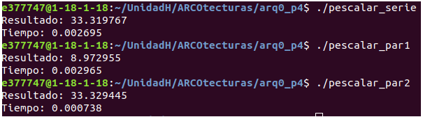

# Práctica 4

Autores:

    Pablo Sánchez Redondo
    David Palomo Marcos

#### Ejercicio 1

1. En una situación ideal, debería estarse corriendo un thread por core, de forma paralela sin interrupción. En realidad, el sistema operativo va a estar cambiando los threads y los procesos por otros continuamente. Entonces tiene bastante sentido lanzar más threads que cores tenga tu equipo. Porque estos threads pueden estar sin utilizar la CPU, por ejemplo, están haciendo una operación de I/O.

1. Tantos threads como tareas que se requieran realizar simultáneamente aunque "realmente" no vaya a ser simultáneo del todo.

1. Cuando se declara una variable privada, se hace una copia y se asigna a cada uno de los threads localmente

1. El valor de una variable privada al comienzo de un thread no está asignado aunque se asignara previamente

1. Al igual que al entrar en la región paralela, el valor de la variable privada no está definido al salir aunque se haya definido antes.

1. Las variables públicas se comparten entre todos los threads y sólo hay una copia de las mismas, ergo si la has definido, va a quedar definida entres o salgas de la región paralela.

#### Ejercicio 2

Resultados:

1.  El 1 es incorrecto.

1. Dado que están siendo generados con la misma semilla se puede observar que el resultado del serie es muy parecido al 2 pero el 1 se queda corto porque no declara la variable sum como shared y la va pisando cada vez.