# Práctica 4

Autores:

    Pablo Sánchez Redondo
    David Palomo Marcos

#### Ejercicio 1

1. En una situación ideal, debería estarse corriendo un thread por core, de forma paralela sin interrupción. En realidad, el sistema operativo va a estar cambiando los threads y los procesos por otros continuamente. Entonces tiene bastante sentido lanzar más threads que cores tenga tu equipo. Porque estos threads pueden estar sin utilizar la CPU, por ejemplo, están haciendo una operación de I/O.

1. Tantos threads como tareas que se requieran realizar simultáneamente aunque "realmente" no vaya a ser simultáneo del todo.

1. Cuando se declara una variable privada, se hace una copia y se asigna a cada uno de los threads localmente

1. El valor de una variable privada al comienzo de un thread no está asignado aunque se asignara previamente

1. Al igual que al entrar en la región paralela, el valor de la variable privada no está definido al salir aunque se haya definido antes.

1. Las variables públicas se comparten entre todos los threads y sólo hay una copia de las mismas, ergo si la has definido, va a quedar definida entres o salgas de la región paralela.

#### Ejercicio 2

Resultados:

1.  El 1 es incorrecto.

1. Dado que están siendo generados con la misma semilla se puede observar que el resultado del serie es muy parecido al 2 pero el 1 se queda corto porque no declara la variable sum como shared y la va pisando cada vez.

#### Ejercicio 4

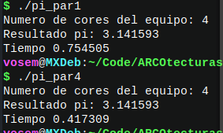

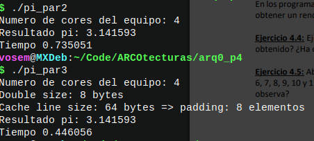

1. n, declarado al principio del programa. El n dado es 100000000.

1. Que par1 va guardando cada suma de cada uno de los threads en una variable compartida y accede una vez por cada iteración del bucle, en cambio par4 accede una única vez por thread.

1. El tiempo de par1 es casi el doble que el tiempo de par4 a pesar que el resultado es el mismo. El rendimiento cambia porque no tiene que esperar tanto para acceder a la variable global aunque en el 1 no se esté pisando la memoria porque cada thread está accediendo a diferentes partes de la misma.

1. El resultado es el mismo y los rendimientos del 2 y del 3 son parecidos al del 1 y el 4 respectivamente

1. El 2 se parece mucho al 1 pero sigue teniendo conflicto al acceder a sum como privada por primera vez. Y el 3 hace un padding entre memoria para quitar conflictos de memoria y funciona bastante mejor que el 1 o el 2 aunque no llega del todo a ser tan eficaz como el 4.

1. El rendimiento va aumentando según el tamaño del padding. A partir del 6 todos los resultados son bastante parecidos y se estabiliza el rendimiento.

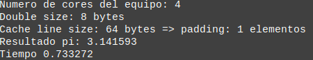
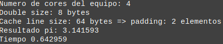
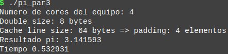
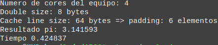
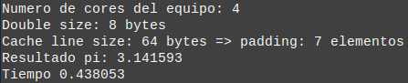
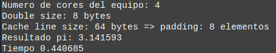
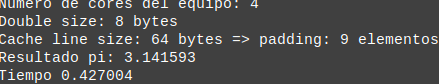
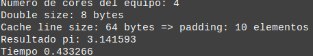
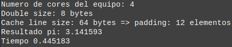